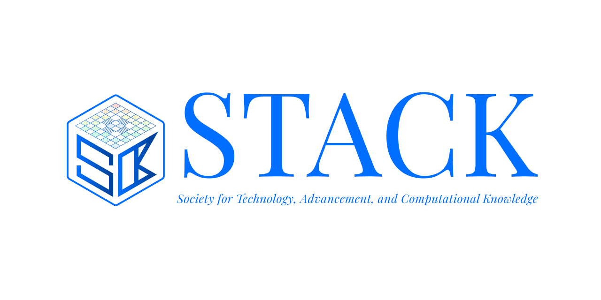

# ✨ Welcome to **STACK, KGEC**! 🚀

**Society for Technology, Advancement, and Computational Knowledge**  
*Kalyani Government Engineering College*

## 🌟 About Us

**STACK, KGEC** is a community at [Kalyani Government Engineering College](https://www.google.com/maps?q=Kalyani+Government+Engineering+College), uniting passionate students, faculty, and alumni who are driven by curiosity, creativity, and a shared love for technology and innovation.

## 🤝 How We Work

- **Collaborative Teams:**  
  We operate through dynamic teams, each dedicated to bringing a specific project, research paper, or innovative idea to life over several months.

- **Mentorship & Learning:**  
  Guided by experienced mentors and faculty, STACK members gain hands-on experience, turning concepts into reality.

- **Continuous Growth:**  
  Beyond projects, our members actively participate in classes and interactive sessions led by both internal and external experts—fostering continuous learning and professional growth within the college community.

## 📚 What We Do

- 💡 **Tech Projects**
- 📈 **Research & Development**
- 🛠️ **Interactive Sessions**
- 🤖 **Coding, AI, and Robotics**
- 🌐 **Networking with Industry Experts**
- 🎓 **Skill Development & Knowledge Sharing**

## 📍 Location

**Kalyani Government Engineering College**  
Kalyani, Nadia, West Bengal, India

## 🚀 Join Us!

Whether you’re a coder, designer, researcher, or tech enthusiast, **STACK, KGEC** welcomes you!  
Connect, collaborate, and create the future with us.

## 📬 Contact & Links

- 📧 [Official College Website](https://www.kgec.edu.in)
- 🌐 [Google Maps Location](https://www.google.com/maps?q=Kalyani+Government+Engineering+College)
